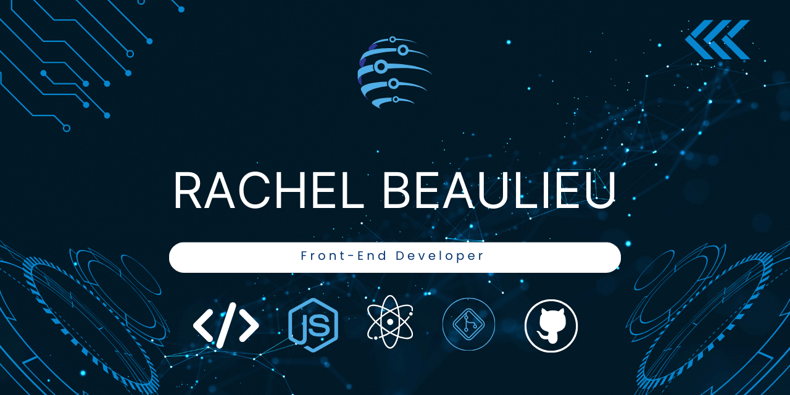

  

<h1 align="center">
  
</h1>

<h3 align="center">A passionate Front-End Developer currently crushing the Meta Certification 🚀</h3>

  
  

---

# Hi, I'm Rachel 👋
### Full-Stack Developer · SaaS Builder · Technical Ops

I don't just learn to code — I build and ship real products. From AI-powered SaaS apps to React Native social platforms, I take ideas from zero to live, production-ready software.

Currently based in Long Island, NY · Relocating · Meta-Certified Front-End Developer

---

## 🚀 What I'm Building

### ⬧ [BidTrack](https://bidtrackapp.com) — Commercial Construction SaaS
> Live at **bidtrackapp.com** · Full-stack · AI-powered

A production SaaS app for commercial construction companies to track their entire bid pipeline — from first contact to signed contract.
- 🤖 AI cost estimator powered by the **Anthropic Claude API** via secure serverless proxy
- 🔐 Multi-user auth + cloud PostgreSQL via **Supabase** with Row-Level Security
- 📄 One-tap PDF pipeline reports, urgency alerts, win rate dashboard
- 📱 Mobile-first UI — installable as a PWA on any phone
- 🌐 Custom domain, marketing landing page, customer install guide

`React 19` `Supabase` `Anthropic API` `Vite` `Vercel` `Node.js` `PostgreSQL`

---

### 🌅 [Alive](https://alive-app-tau.vercel.app) — React Native Social App
> Live · React Native · Real-time

A full-screen swipeable social feed app built with React Native and Expo.
- 🎨 Animated login with cycling scene backgrounds + real Supabase auth
- ⚡ Real-time posts and messaging with custom hooks `usePosts()` + `useMessages()`
- 🕐 Time-of-day color theming, interest-based onboarding, live conversation drawer
- 🗄️ Supabase tables with RLS policies for posts and messages

`React Native` `Expo` `Supabase` `React Navigation` `Vercel`

---

### 🏗️ [ConTech Smart Estimator](https://github.com/RachBlue) — AI-Augmented Calculator
> SaaS Prototype · Data Visualization

Industrial construction cost calculator with 20+ materials, custom multipliers, regional ZIP-based risk assessment, and interactive cost breakdown charts.

`React 19` `Tailwind CSS v4` `Recharts` `Vite`

---

## 🛠️ Tech Stack

**Frontend**
`React 19` `React Native` `JavaScript (ES6+)` `HTML5` `CSS3` `Tailwind CSS` `Vite`

**Backend & Database**
`Supabase (PostgreSQL · Auth · RLS · Real-time)` `Vercel Serverless Functions` `Node.js` `SQL`

**AI & APIs**
`Anthropic Claude API` `Secure API Proxying` `AI SaaS Architecture`

**Tools & Ops**
`Git/GitHub` `VS Code` `Vercel` `Expo` `VPN Setup` `Hardware/IT Support` `Salesforce` `Adobe Creative Suite`

---

## ⚡ Quick Bits

- 🔭 Currently building: **BidTrack** — helping construction companies win more contracts
- 🌱 Always learning: Full-stack architecture, AI integrations, mobile development
- 💬 Ask me about: React, Supabase, deploying SaaS apps, surviving git merge conflicts
- 🏗️ Background: IT Operations + Project Coordination at Arvista Corporation
- ⚡ Fun fact: I built a live SaaS product with AI, auth, and a custom domain — and it only took 3 tries to get the URL right 😄

---

### 🛠️ Languages and Tools

  

---

### 📊 My GitHub Stats

  

  

 

  

---

### 📫 Connect with me
## 📫 Connect

---

### 🐍 My Contribution Snake
<picture>
  <source media="(prefers-color-scheme: dark)" srcset="https://raw.githubusercontent.com/RachBlue/RachBlue/output/github-contribution-grid-snake-dark.svg" />
  <source media="(prefers-color-scheme: light)" srcset="https://raw.githubusercontent.com/YOUR_USERNAME/YOUR_USERNAME/output/github-contribution-grid-snake.svg" />

  

</picture>

---
  *Building real things. Shipping fast. Learning everything.*
